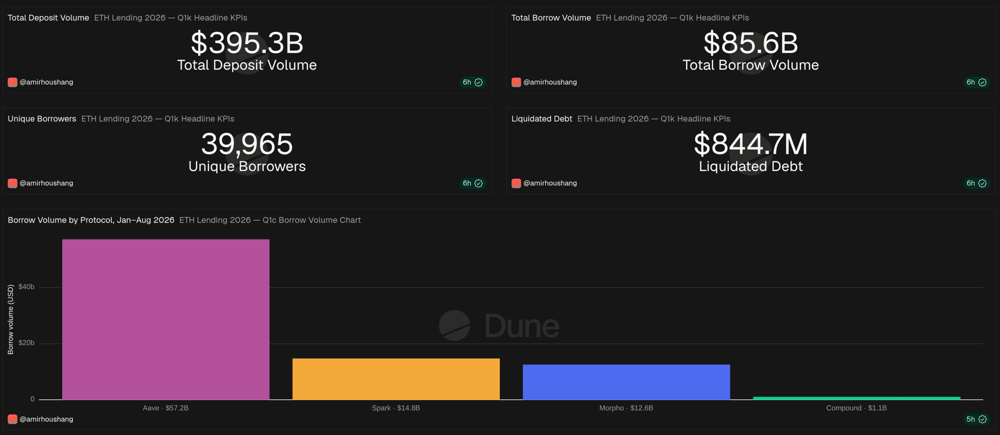
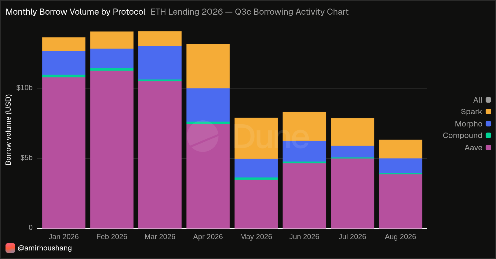
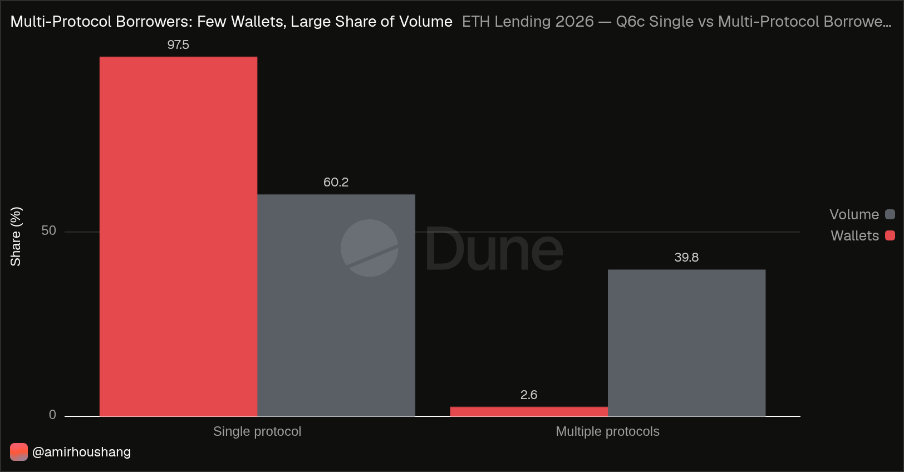
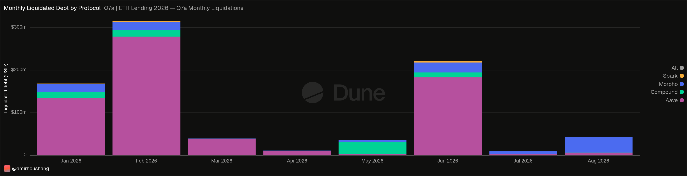
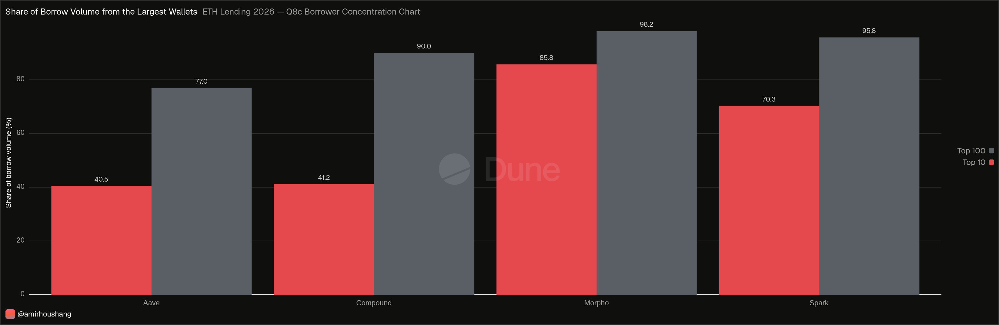

# Crypto Lending on Ethereum: Aave vs. Compound vs. Morpho vs. Spark

Borrowing activity, users, asset mix and liquidations of four major DeFi lending protocols on Ethereum mainnet, 1 January – 31 August 2026. Built with Dune SQL.

**Live dashboard:** [dune.com/amirhoushang/crypto-lending-on-ethereum-aave-vs-compound-vs-morpho-vs-spark](https://dune.com/amirhoushang/crypto-lending-on-ethereum-aave-vs-compound-vs-morpho-vs-spark)  
**Detailed findings:** [report/findings.md](report/findings.md)

---

## Key findings

| # | Finding | Evidence |
|---|---------|----------|
| 1 | **Aave dominates.** It handles two thirds of all borrowing ($57.2B of $85.6B) and about 90% of all borrower wallets. | Q1, Q6 |
| 2 | **Spark is second by volume, not by users.** $14.8B was borrowed by only 1,409 wallets. Its median loan ($58.8K) is twelve times Aave's ($4.9K). | Q1, Q8 |
| 3 | **A small group moves the market.** 2.6% of borrower wallets use more than one protocol, yet they account for 39.8% of borrow volume. 499 wallets using both Aave and Spark alone hold 28.6%. | Q6 |
| 4 | **Borrowing is highly concentrated.** The 10 largest wallets account for 40.5% of borrow volume on Aave and 85.8% on Morpho. | Q8 |
| 5 | **Stablecoins are the main product.** Roughly three quarters of borrowing on Aave, Morpho and Spark is in dollar tokens. Compound is the exception, with WETH as its largest borrowed asset. | Q5 |
| 6 | **Liquidations come in waves.** January, February and June account for 83.5% of liquidated debt. | Q7a |

Full answers to every sub-question: [report/findings.md](report/findings.md)

---

## Research question

> How did Aave, Compound, Morpho and Spark differ in borrowing activity, user activity, asset composition and liquidations on Ethereum from January through August 2026?

### Hypotheses (set before the analysis)

| # | Hypothesis | Result | Evidence |
|---|------------|--------|----------|
| H1 | Aave has the highest borrow volume | ✅ Confirmed | $57.2B, 66.8% of total (Q1) |
| H2 | Stablecoins make up more than 60% of borrow volume | 🟡 Partly | Aave ~77%, Morpho ~79%, Spark ~74%; Compound only ~57% (Q5) |
| H3 | Median loan size differs by more than a factor of 2 between protocols | ✅ Confirmed | Spark $58.8K vs. Morpho $2.4K, factor ~25 (Q8) |
| H4 | The 10 largest wallets hold more than 25% of borrow volume on every protocol | ✅ Confirmed | 40.5% (Aave) to 85.8% (Morpho) (Q8) |
| H5 | Fewer than 10% of borrowers use more than one protocol | ✅ Confirmed | 2.6% (Q6) |
| H6 | Liquidations cluster in a few months instead of spreading evenly | ✅ Confirmed | Jan, Feb and Jun = 83.5% of liquidated debt (Q7a) |

---

## DeFi lending in plain English

A bank checks your income before it lends you money. A DeFi lending protocol does not: instead, you lock up crypto as collateral. For example, you deposit ETH worth $10,000 and borrow $5,000 in USDC against it. If the value of your ETH falls too far, part of it is sold automatically to repay the loan — this is a **liquidation**. Anyone can trigger a liquidation and earn a small reward for doing so; these actors are called **liquidators**.

| Term | Meaning in this project |
|------|-------------------------|
| Deposit / Supply | Putting crypto into the protocol |
| Withdraw | Taking it out again |
| Borrow / Repay | Taking out a loan / paying it back |
| Liquidation | Forced repayment of a loan whose collateral fell too far in value |
| Wallet | A blockchain address — not necessarily one person |

---

## Scope

**Included:** Ethereum mainnet · 1 Jan – 31 Aug 2026 (UTC) · Aave, Compound, Morpho, Spark · deposits, withdrawals, borrows, repayments, liquidations · users, tokens, loan sizes, concentration.

**Excluded:** other chains · centralised lenders · interest rates / APY · TVL and outstanding balances · flash loans · forecasts.

---

## Data and methodology

**Source:** Dune curated tables [`lending.supply`](https://docs.dune.com/data-catalog/curated/lending/supply) and [`lending.borrow`](https://docs.dune.com/data-catalog/curated/lending/borrow).

**Step 1 — data check before analysis (Q0).** Before writing any analysis query, Q0 listed every protocol, version and transaction type in the period. It revealed five things that would otherwise have produced wrong numbers:

1. Liquidations are labelled `borrow_liquidation` (debt side) and `deposit_liquidation` / `supply_liquidation` (collateral side) — not `liquidation`.
2. Compound labels deposits as `supply`, the other protocols as `deposit`.
3. `amount_usd` is signed: withdrawals, repayments and liquidations are negative. All volumes use `ABS()`.
4. Some Morpho collateral-side liquidation rows carry obviously broken USD values. The collateral side is not used in this analysis.
5. Compound v2 has repayments and liquidations but no borrow events in the source table.

**Step 2 — protocol selection.** Morpho passed the pre-set inclusion rule: 100,941 borrow events (>10,000), 90.5% USD coverage on borrow events (>90%) and data in both tables. Spark was added as a fourth protocol because Q0 showed it is larger than Compound by borrow volume; excluding it would have distorted the comparison.

**Step 3 — rules applied in every query**

- Same filter everywhere: `blockchain = 'ethereum'`, the four protocols, `block_time` from `2026-01-01` to before `2026-09-01`, plus `block_month` for partition pruning.
- Protocol versions are aggregated.
- Wallets are always counted with `COUNT(DISTINCT …)`. Monthly counts are never summed into a period total.
- Liquidations are measured on the **debt side only**. Adding the collateral side would count every liquidation twice.
- Volumes are called *activity*, never *TVL*.

**Step 4 — dashboard helper queries.** Dune cannot filter or rename series inside a chart. Small helper queries (suffix `c`, `k`, `d`) read the saved results of the main queries (`FROM query_<id>`) and reshape them for charts — without scanning the lending tables again.

---

## Query overview

| File | What it answers | Reads from |
|------|-----------------|------------|
| `q0_data_coverage.sql` | Which protocols, versions and transaction types exist; USD coverage | lending tables |
| `q1_protocol_market_overview.sql` | Total activity and market share per protocol | lending tables |
| `q1k_headline_kpis.sql` | Four headline numbers for the dashboard | Q1, Q6 |
| `q1c_borrow_volume_chart.sql` | Borrow volume chart with one colour per protocol | Q1 |
| `q2_monthly_supply_activity.sql` | Monthly deposits and withdrawals | lending tables |
| `q2c_supply_activity_chart.sql` | Deposits and withdrawals side by side for charts | Q2 |
| `q3_monthly_borrowing_activity.sql` | Monthly borrows and repayments | lending tables |
| `q3c_borrowing_activity_chart.sql` | Borrows and repayments side by side for charts | Q3 |
| `q4_active_users.sql` | Monthly active depositors and borrowers | lending tables |
| `q5_asset_composition.sql` | Deposited and borrowed tokens per protocol | lending tables |
| `q5c_borrowed_assets_chart.sql` | Borrow-side token mix for the chart | Q5 |
| `q6_cross_protocol_user_overlap.sql` | Which protocol combinations borrowers use | lending tables |
| `q6c_single_vs_multi_protocol.sql` | Single- vs. multi-protocol borrowers | Q6 |
| `q7a_monthly_liquidations.sql` | Monthly liquidated debt and liquidation intensity | lending tables |
| `q7b_top_liquidated_assets.sql` | Liquidated debt by token, with largest transaction | lending tables |
| `q7c_top_liquidated_assets.sql` | Top 5 liquidated tokens per protocol | Q7b |
| `q7d_liquidation_summary.sql` | Liquidation totals per protocol for the whole period | Q7a |
| `q8_loan_size_and_concentration.sql` | Loan size distribution and top-wallet concentration | lending tables |
| `q8c_borrower_concentration_chart.sql` | Top 10 / Top 100 wallet shares for the chart | Q8 |

---

## Dashboard

Selected charts below. All tables and explanations are on the [live dashboard](https://dune.com/amirhoushang/crypto-lending-on-ethereum-aave-vs-compound-vs-morpho-vs-spark); all numbers are in `data/`.

**Headline numbers and borrow volume by protocol**


**Monthly borrow volume** — Aave borrowing fell from about $11B per month in Q1 to $3.5–5B from May, while Spark grew.


**Multi-protocol borrowers** — 2.6% of wallets, 39.8% of borrow volume.


**Monthly liquidated debt** — three months account for 83.5% of all liquidations.


**Borrower concentration** — share of borrow volume held by the 10 and 100 largest wallets.


---

## Verification

Large single events were checked on Etherscan. The biggest Compound liquidation — $27.7M on 9 May 2026 — turned out to be a special case: it was executed by **Compound's Community Multisig**, absorbing a single rsETH-collateralised position, not by a regular market liquidator ([transaction](https://etherscan.io/tx/0x9c17cb1f32c5b4ff792b19c39a31119272d67c3eb6e03ef4cffc8578c568113e)). It explains Compound's May spike and raises its liquidation intensity from 3.8% to 6.3%. The event is kept in the data and flagged on the dashboard.

---

## Limitations

- Volumes are transaction activity, not TVL or outstanding debt. Repayments can relate to loans opened before 2026, so borrows minus repayments is not open debt.
- About 10% of Morpho transactions have no USD price, so Morpho volumes are understated.
- Compound v2 borrow events are missing from the source table, so Compound borrow volume is understated.
- Aave means the core market only; the separate Lido, Horizon and EtherFi Aave markets are excluded.
- One wallet is not one person. Contracts, vaults and bots appear as wallets — especially on Morpho, where a few hundred wallets make tens of thousands of deposits per month.
- Liquidation intensity (liquidated debt ÷ borrow volume) is an activity indicator, not a default rate or risk score.
- Medians and percentiles use Trino's `approx_percentile` and are close estimates.
- The analysis describes what happened; it does not explain why. No causal claims are made.

---

## Repository structure

```text
ethereum-lending-analysis/
├── README.md
├── queries/    19 queries (Q0–Q8 and dashboard helpers)
├── data/       13 CSV exports of the query results
├── images/     dashboard screenshots
└── report/
    └── findings.md   detailed results, hypotheses and spot checks
```

## How to reproduce

1. Copy any file from `queries/` into a new query on [dune.com](https://dune.com) and run it.
2. Main queries (Q0–Q8) run on their own. Helper queries reference the main queries by ID (`query_<id>`); replace the ID with your own copy of the main query.
3. Results should match the CSV files in `data/`, as long as Dune's curated tables have not been backfilled since the export.

---

**Author:** [@Amirhouschang](https://github.com/Amirhouschang) · Dune: [@amirhoushang](https://dune.com/amirhoushang)
